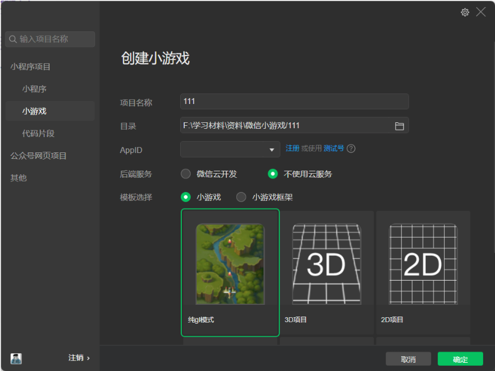

## 见缝插针

### 初始化项目

打开微信开发者工具，选择小游戏，后端服务选择不使用云服务，模板选择默认的纯gl模式，点击确定新建项目。



新建完成后，默认的是项目自带的飞机大战小游戏，现在需要删除一些文件，使项目为初始状态。

```js
// main.js
const ctx = canvas.getContext('2d')

/**
 * 游戏主函数
 */
export default class Main {
  constructor() {

  }
}
```

目录结构为：

```bash
├── js
|   ├── libs
|   |   ├── symbol.js
|   |   ├── weapp-adapter.js
|   └──  main.js
├── .eslintrc.js
├── game.js
├── game.json
├── project.config.json
├── project.private.config.json
└──  README.md
```

### 开发

main.js：

```js
import Ball from "./ball"
import Lollipop from "./lollipop"
import { randomHexColor } from "./util"
import Background from "./background"
const ctx = canvas.getContext('2d')

// 屏幕的宽带
const screenWidth = window.innerWidth
// 屏幕的高度
const screenHeight = window.innerHeight
// 提示框的宽度
const promptBgWidth = 315
// 提示框的高度
const promptBgHeight = 210
// 大圆的半径
const R = 100
// 小圆的半径
const r = 10
// 速度，每次移动一弧度
const slowSpeed = Math.PI / 180
// 速度，全部插入完成后的速度
const faseSpeed = 3 * slowSpeed
// 每关初始的上面的小球数量
let initLollipop = 6
// 上面小球的数量
let lollipopCount = initLollipop
// 每关初始的小球数量
let initShoot = 6
// 下面小球的数量
let shootCount = initShoot
// 下方小球发射区距离圆心的位置
const offsetY = 300
// 判断是否结束游戏
let isGameOver = false
// 默认为慢速旋转
let speed = slowSpeed
// 背景图片路径
const BG_IMG_SRC = 'js/images/bg.jpg'
// 失败提示图片路径
const PROMPT_IMG_SRC = 'js/images/prompt.jpg'

/**
 * 游戏主函数
 */
export default class Main {
  constructor() {
    this.beginGame()
    this.init()
  }
  init() {
    // 上面小球的集合
    this.lollipopArray = []
    // 发射区的集合
    this.shootArray = []

    for (let i = 0; i < lollipopCount; i++) {
      // 上面小球的起始角度
      let angle = Math.PI * 2 / lollipopCount * i
      let centerX = R * Math.cos(angle)
      let centerY = R * Math.sin(angle)

      let lollipop = new Lollipop(centerX, centerY, r, randomHexColor(), angle)
      this.lollipopArray.push(lollipop)
    }
    
    for (let i = 0; i < shootCount; i++) {
      let centerX = 0
      let centerY = offsetY + i * 2 * r
      let shoot = new Ball(centerX, centerY, r, randomHexColor())
      this.shootArray.push(shoot)
    }

    this.bg = new Background(BG_IMG_SRC, 0, 0, screenWidth, screenHeight)
  }

  beginGame() {
    canvas.removeEventListener(
      "touchstart",
      e => this.touchHandler(e)
    )

    canvas.addEventListener("touchstart", e => this.touchHandler(e))

    window.cancelAnimationFrame(this.aniId)
    this.aniId = window.requestAnimationFrame(
      () => this.loop(),
      canvas
    )
  }

  touchHandler(e) {
    // 通过点击位置判断是否点击的为重新开始
    const touche = e.changedTouches[0]
    const minX = 115
    const minY = 310
    const maxX = 255
    const maxY = 340
    if(touche.pageX < maxX && minX < touche.pageX && touche.pageY < maxY && minY < touche.pageY && isGameOver) {
      // 恢复为初始状态
      isGameOver = false
      speed = slowSpeed
      lollipopCount = initLollipop
      shootCount = initShoot
      this.init()
      return
    }

    // 判断是否发射完小球
    if(!this.shootArray.length && !isGameOver) {
      initLollipop += 1
      initShoot += 2
      lollipopCount += 1
      shootCount += 2
      speed = slowSpeed
      this.init()
      return
    }

    // 如果失败，停止发射小球
    if (isGameOver) {
      return
    }

    this.shootBall()
  }

  shootBall() {
    if(!this.shootArray.length) return
    // shift，删除第一个小球
    const shootItem = this.shootArray.shift()
    // 更新位置
    this.updateShootPosition()
    // 碰撞检测
    this.isCollide(0, R)
    // 插入到正下方
    const lollipop = new Lollipop(0, R, r, shootItem.color, Math.PI / 2)
    this.lollipopArray.push(lollipop)
  }

  isCollide(x, y) {
    this.lollipopArray.forEach(item => {
      const distance = Math.sqrt((item.centerX - x) * (item.centerX - x) + (item.centerY - y) * (item.centerY - y))
      if(distance < 2 * item.radius) {
        isGameOver = true
      }
    })
  }

  updateShootPosition() {
    this.shootArray.forEach((item, index) => {
      item.update(0, offsetY + 2 * r * index)
    })
  }

  loop() {
    // 更新
    this.update()
    // 渲染
    this.render()
    this.aniId = window.requestAnimationFrame(
      () => this.loop(),
      canvas
    )
  }

  update() {
    // 如果失败了结束转动
    if (isGameOver) {
      return
    }

    // 如果全部发射玩下面的小球加速转动
    if (!isGameOver && this.shootArray.length === 0) {
      speed = faseSpeed
    }

    this.lollipopArray.forEach(item => {
      // 小球每次累加1°
      item.angle += speed

      // 获取当前的坐标
      let centerX = R * Math.cos(item.angle)
      let centerY = R * Math.sin(item.angle)

      // 更新小球的位置
      item.update(centerX, centerY)
    })
  }

  render() {
    // Canvas 2D API 的方法，这个方法通过把像素设置为透明以达到擦除一个矩形区域的目的
    ctx.clearRect(0, 0, canvas.width, canvas.height)

    // 是 Canvas 2D API 使用内部方式描述颜色和样式的属性。默认值是 #000 （黑色）
    ctx.fillStyle = "#fff"
    // 是 Canvas 2D API 绘制填充矩形的方法。当前渲染上下文中的fillStyle 属性决定了对这个矩形对的填充样式
    ctx.fillRect(0, 0, canvas.width, canvas.height)
    // 是 Canvas 2D API 描述画笔（绘制图形）颜色或者样式的属性。默认值是 #000 (black)
    ctx.strokeStyle = "black"

    //  绘制背景
    this.bg.render(ctx)

    // 是 Canvas 2D API 通过将当前状态放入栈中，保存 canvas 全部状态的方法
    ctx.save()
    // 对当前网格添加平移变换的方法
    ctx.translate(screenWidth / 2, 200)

    this.lollipopArray.forEach(item => {
      item.render(ctx)
    })

    this.shootArray.forEach(item => {
      item.render(ctx)
    })

    // 绘制大圆
    ctx.beginPath();
    ctx.fillStyle = "pink"
    ctx.strokeStyle = "pink"
    ctx.arc(0, 0, 30, 0, 2 * Math.PI)
    ctx.fill()
    ctx.stroke()

    // 大圆中的小球数量
    ctx.font = "30px Georgia"
    ctx.fillStyle = "#fff"
    ctx.fillText(this.shootArray.length, -7.5, 7.5)

    // 是 Canvas 2D API 通过在绘图状态栈中弹出顶端的状态，将 canvas 恢复到最近的保存状态的方法。如果没有保存状态，此方法不做任何改变
    ctx.restore()

    // 失败后弹出提示
    if (isGameOver) {
      this.promptBg = new Background(PROMPT_IMG_SRC, (screenWidth / 2) - (promptBgWidth / 2), (screenHeight / 2) - (promptBgHeight / 2), promptBgWidth, promptBgHeight)
      this.promptBg.render(ctx)
      ctx.font = "30px Georgia"
      ctx.fillStyle = "red"
      ctx.fillText("重新开始", (screenWidth / 2) - 60, (screenHeight / 2))
    }

    // 下一关
    if(this.shootArray.length === 0) {
      this.promptBg = new Background(PROMPT_IMG_SRC, (screenWidth / 2) - (promptBgWidth / 2), (screenHeight / 2) - (promptBgHeight / 2), promptBgWidth, promptBgHeight)
      this.promptBg.render(ctx)
      ctx.font = "30px Georgia"
      ctx.fillStyle = "red"
      ctx.fillText("下一关", (screenWidth / 2) - 60, (screenHeight / 2))
    }
  }
}
```

util.js：

```js
export function randomHexColor() {
  // 随机生成十六进制颜色
  let color = Math.floor(Math.random() * 16777216).toString(16)
  // 生成ffffff以内的16进制数
  while (color.length < 6) {
    // while循环判断color位数，少于6位前面加0凑够6位
    color = "0" + color
  }
  // 返回"#"开头16进制颜色
  return "#" + color
}
```

lollipop.js：

```js
import Ball from "./ball"

export default class Lollipop extends Ball {
  constructor(centerX, centerY, radius, color = "#000", angle) {
    super(centerX, centerY, radius, color)
    // 当前小球的角度
    this.angle = angle
  }

  render(ctx) {
    super.render(ctx)
    // 是 Canvas 2D API 通过清空子路径列表开始一个新路径的方法
    ctx.beginPath()
    // 是 Canvas 2D API 将一个新的子路径的起始点移动到 (x，y) 坐标的方法
    ctx.moveTo(0, 0)
    // 是 Canvas 2D API 使用直线连接子路径的终点到 x，y 坐标的方法（并不会真正地绘制）
    ctx.lineTo(this.centerX, this.centerY)
    // 是 Canvas 2D API 使用非零环绕规则，根据当前的画线样式，绘制当前或已经存在的路径的方法
    ctx.stroke()
  }
}
```

ball.js：

```js
export default class Ball {
  constructor(centerX, centerY, radius, color = "#000") {
    // x坐标
    this.centerX = centerX
    // y坐标
    this.centerY = centerY
    // 半径
    this.radius = radius
    // 小球颜色
    this.color = color
  }
  
  // 绘制小球
  render(ctx) {
    // 是 Canvas 2D API 通过清空子路径列表开始一个新路径的方法
    ctx.beginPath()
    // 是 Canvas 2D API 使用内部方式描述颜色和样式的属性
    ctx.fillStyle = this.color
    // 是 Canvas 2D API 描述画笔（绘制图形）颜色或者样式的属性
    ctx.strokeStyle = this.color
    // void ctx.arc(x, y, radius, startAngle, endAngle, anticlockwise)
    // 是 Canvas 2D API 绘制圆弧路径的方法。圆弧路径的圆心在 (x, y) 位置，半径为 r，根据anticlockwise （默认为顺时针）指定的方向从 startAngle 开始绘制，到 endAngle 结束
    ctx.arc(this.centerX, this.centerY, this.radius, 0, 2 * Math.PI)
    // 是 Canvas 2D API 根据当前的填充样式，填充当前或已存在的路径的方法
    ctx.fill()
    // 是 Canvas 2D API 使用非零环绕规则，根据当前的画线样式，绘制当前或已经存在的路径的方法
    ctx.stroke()
  }

  // 更新小球位置
  update(x, y) {
    this.centerX = x
    this.centerY = y
  }
}
```

background.js：

```js
export default class background {
  constructor(IMG_SRC, initWidth, initHight, screenWidth, screenHeight) {
    this.img = wx.createImage()
    this.img.src = IMG_SRC
    this.initWidth = initWidth
    this.initHight = initHight
    this.screenWidth = screenWidth
    this.screenHeight = screenHeight
  }
  
  render(ctx) {
    ctx.drawImage(this.img, this.initWidth, this.initHight, this.screenWidth, this.screenHeight)
  }
}
```

目录结构为：

```bash
├── js
|   ├── images
|   ├── libs
|   |   ├── symbol.js
|   |   ├── weapp-adapter.js
|   ├── background.js
|   ├── ball.js
|   ├── lollipop.js
|   ├── util.js
|   └──  main.js
├── .eslintrc.js
├── game.js
├── game.json
├── project.config.json
├── project.private.config.json
└──  README.md
```

项目地址：[见缝插针](https://github.com/povertyPoor/jfcz)
